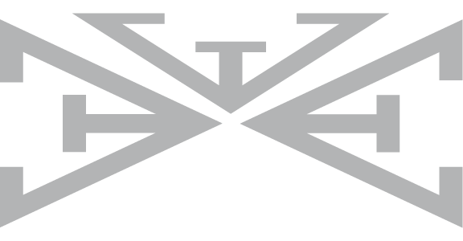

<h1 align="center" style="font-size:50px" vertical-align="middle"> ✌🏾 Hi, I’m Davina!</h1>
 

<h2>  About Me</h2>
I am a digital artist and technologist with a passion for business problem-solving.  I am interested in understanding stakeholder needs to develop effective, technical, and artistic user-centered solutions. 

🔭 I’m currently working on my Portfolio Site and Euphonics 

🌱 I’m currently improving my architecture skills.

<h2> ✨ Connect </h2>     

   

